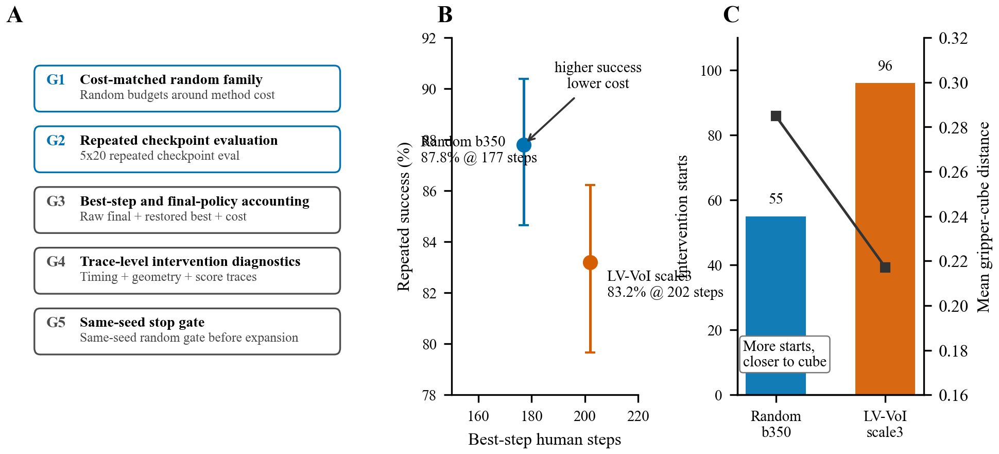
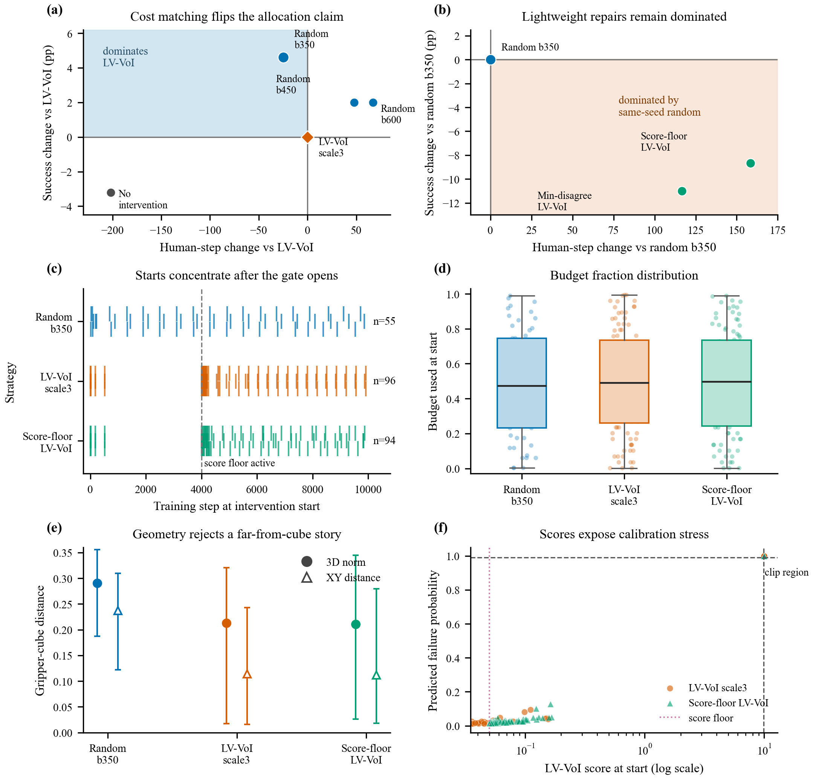

# HIL-RL Human-Attention Diagnostics

Cost-matched diagnostic evaluation for human-attention allocation in
human-in-the-loop reinforcement learning for robotic manipulation.

This repository is organized around a cautious scientific position: the current
LV-VoI trigger is **not** a positive method result. Under a stricter protocol,
the conclusion reverses: a cost-matched random intervention family dominates the
current LV-VoI variant on the Lift case study. The contribution is therefore a
diagnostic evaluation protocol for attention-allocation claims: cost matching,
repeated checkpoint evaluation, and intervention-trace analysis before claiming
that a trigger uses human effort more efficiently.

Start with:

- [PROJECT_DASHBOARD.md](PROJECT_DASHBOARD.md)
- [PAPER_PLAN.md](PAPER_PLAN.md)
- [results/EXPERIMENT_EVIDENCE_REGISTRY.csv](results/EXPERIMENT_EVIDENCE_REGISTRY.csv)
- [results/RESULTS_INDEX.md](results/RESULTS_INDEX.md)
- [figures/FIGURE_ASSET_INDEX.md](figures/FIGURE_ASSET_INDEX.md)
- [paper/PAPER_CLAIM_AUDIT.md](paper/PAPER_CLAIM_AUDIT.md)
- [results/r055_project_quality_pass/MANIFEST.md](results/r055_project_quality_pass/MANIFEST.md)

## Visual Summary

<p align="center">
  
</p>

<p align="center">
  
</p>

Additional diagnostics are available as linked artifacts rather than inline
README images:

- [trigger repair comparison](figures/qa_rendered/fig3_trigger_repairs.png)
- [intervention timing distribution](figures/qa_rendered/fig4_intervention_timing.png)
- [score-over-time diagnostic](figures/qa_rendered/fig5_score_over_time.png)
- [R054 attention-allocation diagnostic PDF](figures/fig_attention_allocation_diagnostics_r054.pdf)
- [R054 data profile and visual QA](results/r054_attention_allocation_figure_optimization/MANIFEST.md)
- [trace geometry boxplots](results/r023_real_trace_seed0_2/r023_intervention_geometry_boxplots.png)
- [R024 repair comparison](results/r024_score_floor_seed0_2/r024_success_cost_compare.png)
- [Stack boundary appendix table](figures/TABLE_stack_boundary_appendix_r053.tex)
- [full figure and table asset index](figures/FIGURE_ASSET_INDEX.md)

## Current Evidence Boundary

The current manuscript route is a diagnostic-protocol paper about scarce human
attention in robot learning, not a paper that claims the current trigger is
superior.

| Claim | Evidence status |
|---|---|
| Cost-matched random baselines are necessary for attention-allocation claims. | R021: `random_b350` reaches `439/500 = 87.8%` at cost `177.0`, while LV-VoI scale3 reaches `416/500 = 83.2%` at cost `202.0`. |
| Repeated checkpoint evaluation is required. | R020-R024 use repeated autonomous checkpoint evaluation rather than one final checkpoint. |
| Lightweight trigger repairs do not recover the claim. | R022 and R024 remain dominated by same-seed `random_b350`. |
| Trace diagnostics are useful for redesign. | R023/R024 show over-triggering and score/timing mismatch rather than a simple "too far from the cube" failure mode. |
| Stack remains boundary evidence. | R018/R053 show no-online matched BC outperforming current online intervention variants on Stack; this is robotics breadth as a limitation, not positive transfer. |

Important limitations:

- The intervention source is a scripted privileged-state oracle, not a real
  teleoperator.
- The experiments are simulated robosuite/MuJoCo manipulation studies, not
  real-robot validation.
- Smoke runs and local tuning probes are kept out of paper claims unless they
  are promoted through the evidence registry.

## Repository Map

| Path | Purpose |
|---|---|
| `foresight_hil/` | Reusable HIL-RL modules: environments, intervention control, VoI gating, oracle logic, metrics, and evaluation helpers. |
| `scripts/` | Training, plotting, checkpoint evaluation, evidence validation, and table-generation entry points. |
| `tests/` | Regression tests for bookkeeping, trace schema, attention diagnostics, evaluation protocol, registry checks, and robosuite startup logic. |
| `results/` | Raw and derived evidence archives. Use the registry before citing numbers. |
| `figures/` | Paper figures, PNG previews, and LaTeX-ready tables. |
| `paper/` | Current manuscript skeleton and audited bibliography. |
| `proposal/` | Historical proposal material; useful background, not the current paper spine. |

Local-only material that is intentionally not tracked in GitHub includes
third-party paper PDFs, generated checkpoints, source snapshot zip files, cache
directories, and process-style experiment notes.

## Verification

Run the full paper-facing verification menu before changing claims, tables,
figures, or evidence rows:

```powershell
python scripts\validate_evidence_registry.py
python scripts\audit_registry_numbers.py
python scripts\generate_claim_tables.py
python scripts\generate_stack_boundary_appendix.py
python scripts\validate_provenance_package.py
python -m unittest discover -s tests
```

Expected current status: registry validation passes, numeric audit passes,
provenance validation passes, and the unit test suite passes. A Gym deprecation
warning may appear; it does not affect the current test result.

## Minimal Usage

Install the Python requirements:

```powershell
pip install -r requirements.txt
```

Run a lightweight toy demonstration:

```powershell
python scripts\run_demo.py
```

Regenerate registry-driven paper tables:

```powershell
python scripts\generate_claim_tables.py
python scripts\generate_stack_boundary_appendix.py
```

Validate that the evidence registry still points to readable sources:

```powershell
python scripts\validate_evidence_registry.py
```

## Citation And Claim Discipline

Use only citation keys present in [paper/references.bib](paper/references.bib)
unless a new source has been verified. Use
[paper/CITATION_AUDIT.md](paper/CITATION_AUDIT.md) for current citation-context
status.

For numeric claims, use the evidence registry and the generated claim tables
rather than copying numbers by hand. The current manuscript-level claim audit is
[paper/PAPER_CLAIM_AUDIT.md](paper/PAPER_CLAIM_AUDIT.md).

- [results/EXPERIMENT_EVIDENCE_REGISTRY.csv](results/EXPERIMENT_EVIDENCE_REGISTRY.csv)
- [figures/TABLE_registry_costmatched_results_r036.tex](figures/TABLE_registry_costmatched_results_r036.tex)
- [figures/TABLE_registry_trigger_repairs_r036.tex](figures/TABLE_registry_trigger_repairs_r036.tex)
- [figures/TABLE_stack_boundary_appendix_r053.tex](figures/TABLE_stack_boundary_appendix_r053.tex)

## Public Repository Notes

This public repository tracks source code, manuscript assets, registry-backed
evidence summaries, figures, tables, and reproducibility checks. It does not
track bulky generated checkpoints or local experiment-planning notes. Those
files may exist in a local workspace but are excluded from the GitHub history so
the repository remains readable and reviewable.
